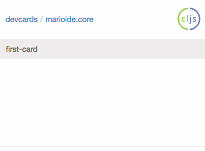
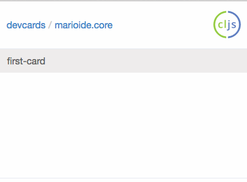
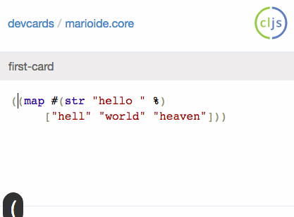

marioide is a small code editor that runs in the (mobile) browser.

Uses replumb, codemirror and parinfer and tries to make not having your full IDE
available as comfortable as possible:

- Notification pop-up for evaluation

- Evaluate a selection (using the handy replumb lib)

- Parinfer and codemirror

- Ctrl+Enter for evaluation of selection/all (for when you connect your keyboard to phone)
